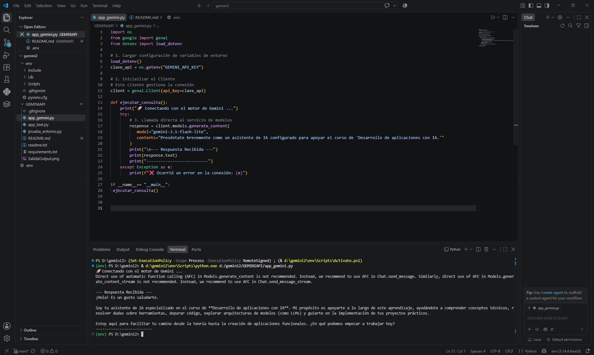

# GEMINIAPI

Aplicación en Python que se conecta a la API de Google Gemini para generar contenido de texto usando el modelo `gemini-3.1-flash-lite`.

## Tecnologías usadas
- Python
- Google Gen AI SDK (`google-genai`)
- python-dotenv
- Git / GitHub

## Estructura del proyecto
1.) app_gemini.py
2.) requirements.txt
## Instrucciones de instalación y ejecución

### 1. Clonar el repositorio
```bash
git clone https://github.com/Hatchedbot/GEMINIAPI.git
cd GEMINIAPI
```

### 2. Crear entorno virtual
```powershell
python -m venv env
```

### 3. Activar entorno virtual
```powershell
env\Scripts\activate
```

### 4. Instalar librerías
```powershell
pip install -r requirements.txt
```

### 5. Configurar la API Key de Gemini
Crea un archivo llamado `.env` en la raíz del proyecto y agrega tu clave:
GEMINI_API_KEY=tu_clave_aqui
> Puedes obtener tu API Key en [Google AI Studio](https://aistudio.google.com/apikey).

### 6. Ejecutar la aplicación
```bash
python app_gemini.py
```

## Control de versiones (comandos usados durante el desarrollo)

```bash
git init
git add .
git commit -m "mensaje"
git remote add origin https://github.com/Hatchedbot/GEMINIAPI.git
git push -u origin main
```

## Evidencia de ejecución

[Evidencia de ejecución]()

## Autor
Joan Sebastian Lara Fuenmayor - 506242012